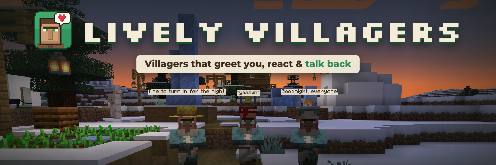

# Lively Villagers



Every villager gets a name, a personality and something to say. They greet you as you pass, react to what you build, thank you for gifts, panic when monsters show up and yawn at bedtime. A small touch that makes vanilla villages feel alive.

No new blocks, items or textures: just villagers that feel like they live there. It runs on the server only, so friends can join with an unmodded game.

- **Greetings:** walk within 7 blocks of a villager and they may say hi (cheerful always, curious usually, grumpy and shy about half the time). If they stay quiet they get another chance after 15 seconds; once they greet you they wait 90 seconds.
  What they say depends on your reputation, the time of day and the weather.
- **Block reactions:** villagers react to blocks placed near them. They love their own workstation, like
  flowers, lanterns, beds and crops, dislike skulls, cobwebs and magma, are scared of TNT, and complain if you
  build right on top of them. Break their workstation, bed or bell and they'll tell you about it.
- **Gifts:** throw flowers, cookies or berries (or cake, pumpkin pie or honey for extra love) near a villager.
  They walk over, take it, hold it for a moment and thank you. The first gift each Minecraft day raises your
  reputation with them a little, which also makes their trades cheaper.
- **Danger:** villagers also fear creepers, skeletons, spiders, witches and more, shout when they panic, run
  from lit TNT and hissing creepers, and calm down afterwards.
- **Right-click:** villagers without a job (and nitwits) grumble ("Hey...", "Stop touching me!"); working villagers greet you with a shop line before trading opens.
- **Raids:** the first villager to spot a raid shouts a warning and sends the neighbours to hide. Villagers
  cower with raid lines, beg you for help, then cheer if you win (or mourn if you lose).
- **Last words:** sometimes a dying villager says something on the way out; the bubble stays where they fell.
- **Night:** after dark villagers get sleepy: yawning greetings, "Time to turn in for the night." when they head to bed, tired shop lines, and sleep-talk if you poke them while they sleep.
- **Introductions:** sneak and right-click a villager with an empty hand to have them introduce themselves.

## Install
1. Install Fabric Loader for 1.21.1 and [Fabric API](https://modrinth.com/mod/fabric-api).
2. Put `lively-villagers-<version>.jar` in your `mods` folder.

It's server-side: on a server, only the server needs it; players can join with a vanilla client.

## Commands
- `/lively info`: name, personality and your reputation for the villager you're looking at.
- `/lively personality <cheerful|curious|shy|grumpy>` (operators): change a villager's personality.
- `/lively reload` (operators): reload the config file.

Name tags rename a villager in their speech too.

## Config
`config/lively-villagers.json` is created on first launch. You can turn each feature off, set the greeting
radius and cooldown, and set how much reputation gifts give.

## Notes
- Villagers only pick up gifts when the `mobGriefing` game rule is on (same as vanilla bread and seeds).
- Because villagers now also fear creepers and skeletons, a group of scared villagers can call an iron golem
  for those mobs too, the same way vanilla villagers do for zombies.

## Building

Gradle needs **JDK 25** (Loom 1.18); the mod itself targets Java 21, so a JDK 21 must be installed too.

```
./gradlew build                      # jar in build/libs/
./gradlew runClient -Pselftest       # scripted in-game test (SELFTEST lines in the log)
./gradlew runClient -Praidtest       # a real raid on a real village (RAIDTEST lines)
```

More in [docs/DEVELOPMENT.md](docs/DEVELOPMENT.md): code layout, testing, and notes on vanilla villager internals.

## License

[MIT](LICENSE).

## Credits

- Built on [Fabric](https://fabricmc.net/) and Fabric API.
- Developed with the help of AI (Claude Code by Anthropic).
